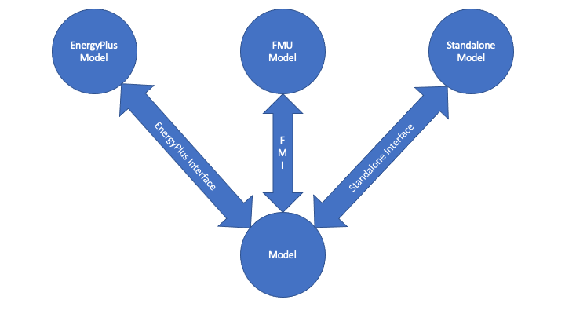

# Portable Component Model

The portable component model outlines the methods needed to define a standalone component model, and then export that model to be used as either a FMU via the FMI interface or included in EnergyPlus.

## Structure

